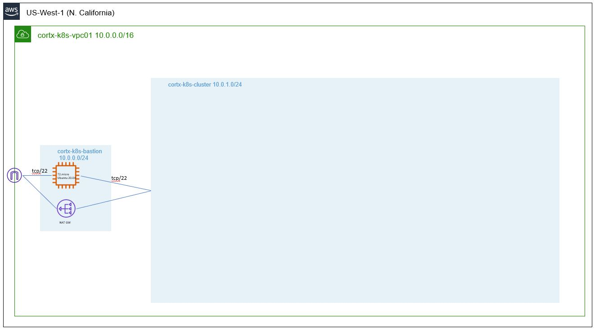

# CORTX on AWS and Kubernetes - Quick Install Guide

## Prerequisites

The following environment should exist in AWS prior to further deployment:
 - VPC
   - Bastion subnet
     - Security group with SSH (tcp/22) open for access
     - Bastion host
       - as of now an SSH key is required for access to private Github repository (https://github.com/Seagate/cortx-k8s), it will be resolved soon
       - an SSH key for passwordless access to CORTX K8s nodes
       - AWS CLI installed and configured
     - NAT GW for outgoing Internet access from the cluster (private) subnet
   - Cluster subnet
     - Security group with SSH (tcp/22) access from the Bastion subnet
 <p align="center">
    
 </p>

 We recommend to execute the following steps from the Bastion host

## Kubernetes cluster provisioning

CORTX requires Kubernetes cluster for installation. In the current release such cluster must have at least 3 worker nodes.
 - Every node must have at least 8 cores and 16 GB of RAM. 
 - While there should be no dependencies on the underlying OS, this procedure was tested with CentOS 7.9 and Kubernetes 1.22
 - In the current release, every node should have the following storage configuration:
   - OS disk (in the example below we'll provision 50GB)
   - Disk for 3rd party applications required for normal CORTX installation (25GB in this procedure)
   - Disk for internal logs (currently not in use, 25GB in the example below)
   - Disks for customers' data and metadata. In this demo we'll provision 2 disks for metadata and 4 disks for data (25GB each)

If you already have a suitable Kubernetes cluster please proceed to the next step

### Define basic cluster configuration
```
# Number of nodes in the Kubernetes cluster 
ClusterNodes=3
# Name tag for all EC2 instances and EBS volumes provisioned for this CORTX cluster
ClusterTag=cortx-k8s-cl03
# AWS Subnet ID for cluster provisioning
SubnetId=subnet-070838693db278eab
# Security Group ID for the cluster
SecurityGroupId=sg-0585145ff6b831b77
# Key pair name for all instances
KeyPair=cortx-k8s-test
# Define SSH flags for connectivity from the bastion host to CORTX nodes
SSH_FLAGS='-o UserKnownHostsFile=/dev/null -o StrictHostKeyChecking=no -i ~/.ssh/cortx-k8s-test.pem'

mkdir $ClusterTag
cd $ClusterTag
```

### Launch new instances 
This command will launch specified number of EC2 c5.2xlarge instances with CentOS 7.9 and required storage configuration
```
aws ec2 run-instances --image-id ami-08d2d8b00f270d03b --count $ClusterNodes --instance-type c5.2xlarge --subnet-id $SubnetId --block-device-mappings "[{\"DeviceName\":\"/dev/sda1\",\"Ebs\":{\"SnapshotId\":\"snap-09d731c1a0b1ff4cb\",\"VolumeSize\":50,\"DeleteOnTermination\":true}}, {\"DeviceName\":\"/dev/sdb\",\"Ebs\":{\"VolumeSize\":25,\"DeleteOnTermination\":true}}, {\"DeviceName\":\"/dev/sdc\",\"Ebs\":{\"VolumeSize\":25,\"DeleteOnTermination\":true}}, {\"DeviceName\":\"/dev/sdd\",\"Ebs\":{\"VolumeSize\":25,\"DeleteOnTermination\":true}}, {\"DeviceName\":\"/dev/sde\",\"Ebs\":{\"VolumeSize\":25,\"DeleteOnTermination\":true}}, {\"DeviceName\":\"/dev/sdf\",\"Ebs\":{\"VolumeSize\":25,\"DeleteOnTermination\":true}}, {\"DeviceName\":\"/dev/sdg\",\"Ebs\":{\"VolumeSize\":25,\"DeleteOnTermination\":true}}, {\"DeviceName\":\"/dev/sdh\",\"Ebs\":{\"VolumeSize\":25,\"DeleteOnTermination\":true}}, {\"DeviceName\":\"/dev/sdi\",\"Ebs\":{\"VolumeSize\":25,\"DeleteOnTermination\":true}}]" --tag-specifications 'ResourceType=instance,Tags=[{Key=Name,Value='$ClusterTag'}]' 'ResourceType=volume,Tags=[{Key=Name,Value='$ClusterTag'}]'    --key-name $KeyPair --security-group-ids $SecurityGroupId
```

Wait until all instances get into Running state.

### Additional preparations for Kubernetes setup
```
# List of all private IPs 
ClusterIPs=`aws ec2 describe-instances --filters Name=tag:Name,Values=$ClusterTag --query "Reservations[*].Instances[*].{IP:PrivateIpAddress}" --output text | tr '\n' ' '`
# List of all Instance IDs 
ClusterInstances=`aws ec2 describe-instances --filters Name=tag:Name,Values=$ClusterTag --query "Reservations[*].Instances[*].InstanceId" --output text`
# Designate one of the instances as a ControlPlane node
ClusterControlPlaneInstance=`echo $ClusterInstances | awk '{print $1}'`
ClusterControlPlaneIP=`aws ec2 describe-instances --filters Name=tag:Name,Values=$ClusterTag Name=tag:CortxClusterControlPlane,Values=true --query "Reservations[*].Instances[*].{IP:PrivateIpAddress}" --output text`

# Tag all cluster nodes based on their role
for inst in $ClusterInstances; do echo $inst; aws ec2 create-tags --resources $inst --tags Key=CortxClusterControlPlane,Value=false; done
aws ec2 create-tags --resources $ClusterControlPlaneInstance --tags Key=CortxClusterControlPlane,Value=true

# Disable source/destination checking - required for Calico networking in AWS
for inst in $ClusterInstances; do echo $inst; aws ec2 modify-instance-attribute --instance-id=$inst --no-source-dest-check; done

```

### Install required SW packages
```
# Update the Operating System
for ip in $ClusterIPs; do echo $ip; ssh $SSH_FLAGS centos@$ip sudo yum update -y; done

#Update /etc/hosts on all worker nodes
aws ec2 describe-instances --filters Name=tag:Name,Values=$ClusterTag --query "Reservations[*].Instances[*].{IP:PrivateIpAddress,Name:PrivateDnsName}" --output text | tr '\.' ' ' | awk '{print $1"."$2"."$3"."$4" "$5" "$5"."$6"."$7"."$8}' > hosts.addon.$ClusterTag

for ip in $ClusterIPs; do echo $ip; scp $SSH_FLAGS hosts.addon.$ClusterTag centos@$ip:/tmp; ssh $SSH_FLAGS centos@$ip "cat /etc/hosts /tmp/hosts.addon.$ClusterTag > /tmp/hosts.$ClusterTag; sudo cp /tmp/hosts.$ClusterTag /etc/hosts"; done

# Install Docker
for ip in $ClusterIPs; do echo $ip; ssh $SSH_FLAGS centos@$ip "sudo yum install -y yum-utils; sudo yum-config-manager --add-repo https://download.docker.com/linux/centos/docker-ce.repo; sudo yum -y install docker-ce docker-ce-cli containerd.io; sudo systemctl start docker; sudo systemctl enable docker; sudo usermod -aG docker centos"; done
```

